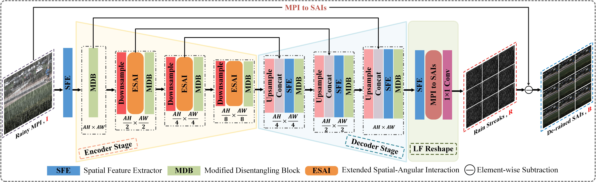
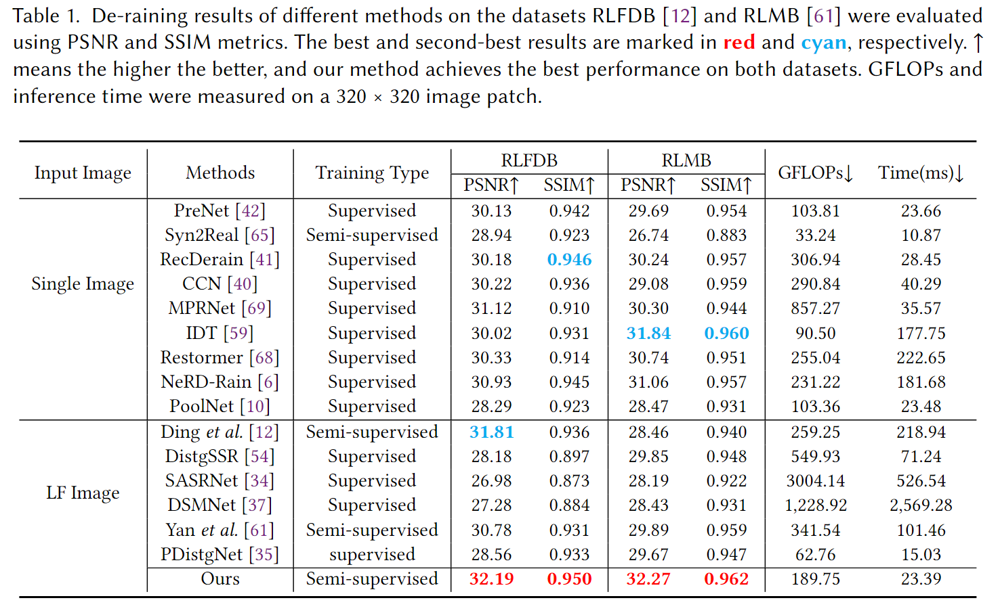

# MDeRainNet
**Tao Yan, Weilong Huang, Weijiang He, Chenglong Wang, Cihang Wei, Yiwei Lu,Xiangjie Zhu, Yinghui Wang and Rynson W.H.Lau**  

**The architecture of our proposed MDeRainNet.**

**The results of MDeRainNet:**

**Pretrained model: https://mega.nz/folder/wjwHFI6Z#5a-3cqe_2j6qcJECTLa2kQ**
